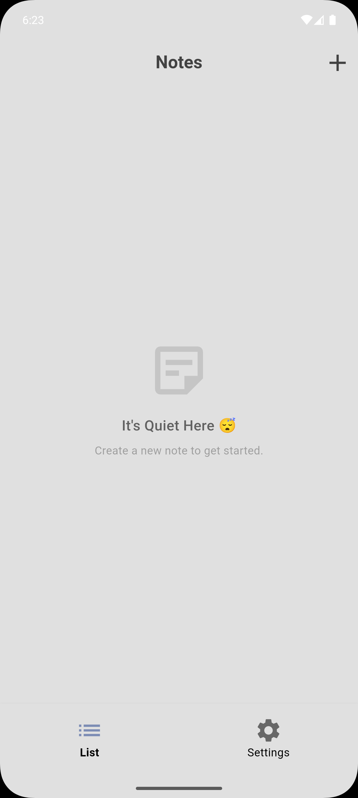
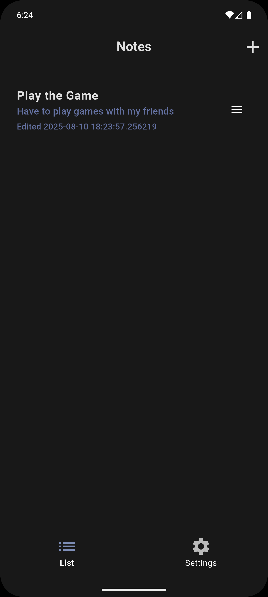
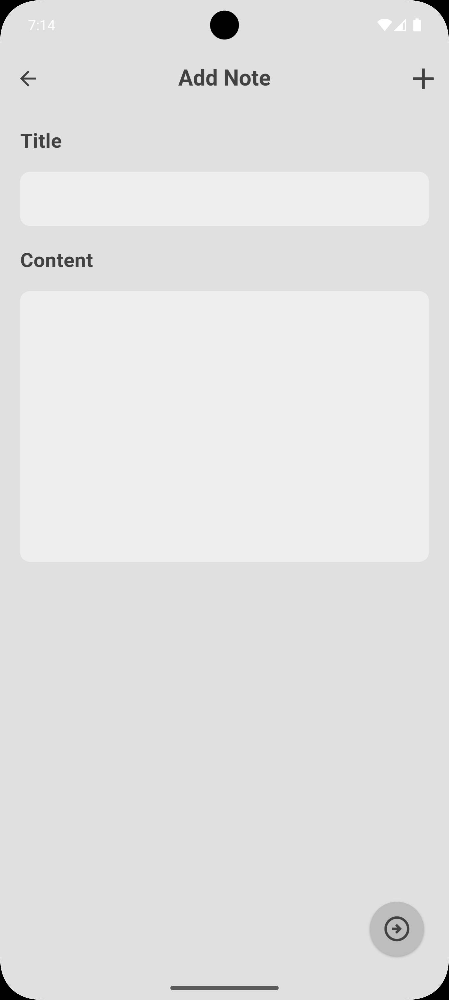
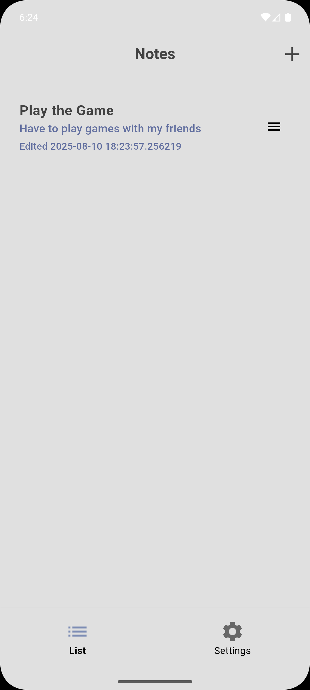
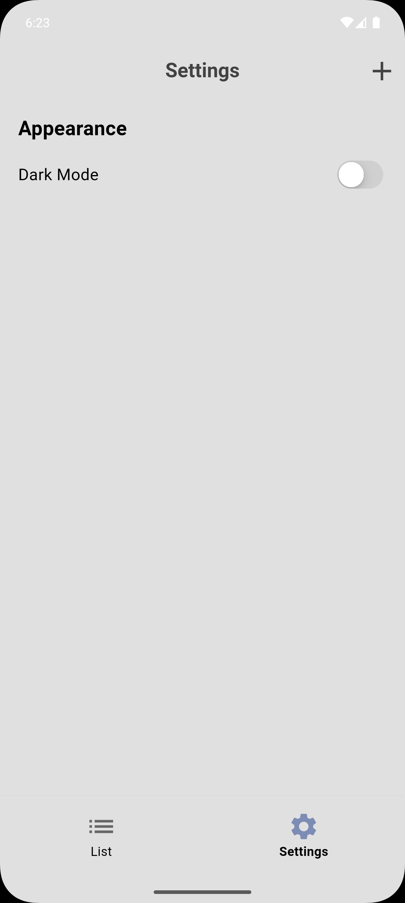
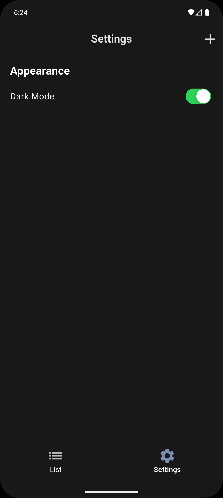

# 🎉 Note-Taking App with Flutter & GetX 🌟

Welcome to the **Note-Taking App**, a sleek and intuitive application built using **Flutter** with **GetX** for state management and **Isar** for offline database storage. This is my first venture into offline databases, and I'm excited to share this project with you! 📝✨

## 🚀 Features
- 🌙 Dark Mode & Light Mode toggle
- 📝 Add, edit, and delete notes effortlessly
- 💾 Offline storage with Isar database
- 🎨 Beautiful UI with Flutter's aesthetic design
- 🔄 Real-time updates with GetX

## 📸 Screenshots
| Light Mode | Dark Mode | Add Note | Notes List (Light) | Notes List (Dark) | Settings (Light) | Settings (Dark) |
|------------|-----------|----------|---------------------|-------------------|------------------|-----------------|
|  |  |  |  |  |  |  |


## 📂 Project Structure
```
lib/
├── controller/
│   ├── note_controller.dart
│   └── note_binders.dart
├── models/
│   ├── note.dart
│   └── note_database.dart
├── screens/
│   ├── add_note_page.dart
│   ├── home_page.dart
│   ├── notes_page.dart
│   ├── settings_screen.dart
│   └── splash_screen.dart
├── theme/
│   ├── theme.dart
│   └── theme_controller.dart
├── widgets/
│   ├── note_card.dart
│   └── note_settings.dart
└── main.dart
```

## 🛠️ Tech Stack
- **Flutter**: For the cross-platform UI
- **GetX**: For state management and navigation
- **Isar**: For offline database storage
- **Dart**: The programming language

## 📋 Getting Started
1. 📥 Clone the repository:
   ```bash
   git clone https://github.com/OnoPUNPUN/Note-App.git
   ```
2. 📦 Install dependencies:
   ```bash
   flutter pub get
   ```
3. 🚀 Run the app:
   ```bash
   flutter run
   ```

## 🤝 Contributing
Feel free to open issues or submit pull requests! Contributions are welcome. 😄

## 🎯 Future Improvements
- Add note categories 📑
- Implement search functionality 🔍
- Enhance UI with animations 🎞️

## 🙏 Acknowledgments
- Thanks to the Flutter, GetX, and Isar communities for their amazing tools! 🌐
- Inspired by my first dive into offline databases! 🎉